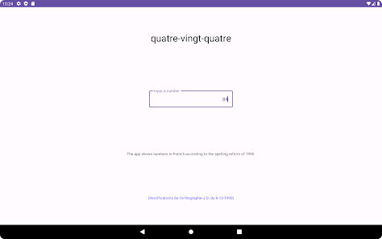

# CheckHelper

CheckHelper is an Android application that helps users convert numbers to words in French to help writing checks.

## Screenshots

## Installation

You can download and install CheckHelper from the [Google Play Store](https://play.google.com/store/apps/details?id=com.sellisd.checkhelper).
